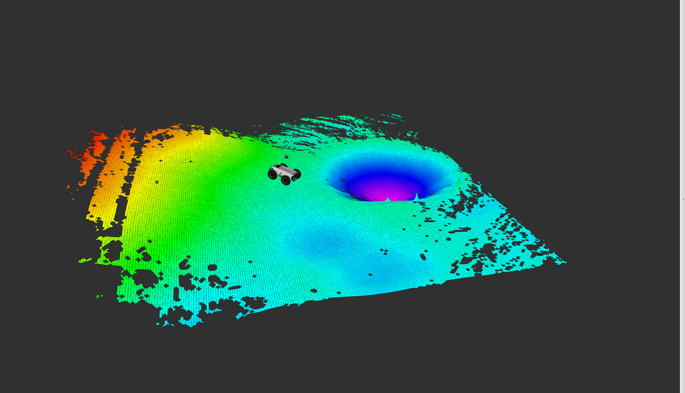
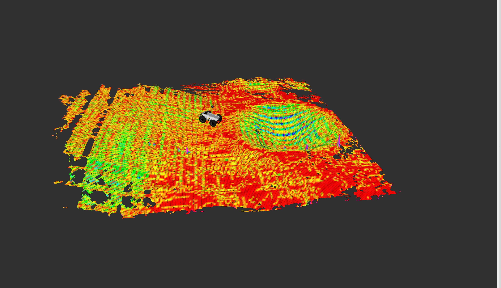
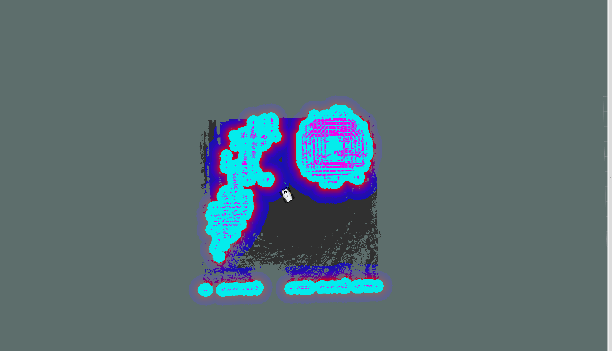
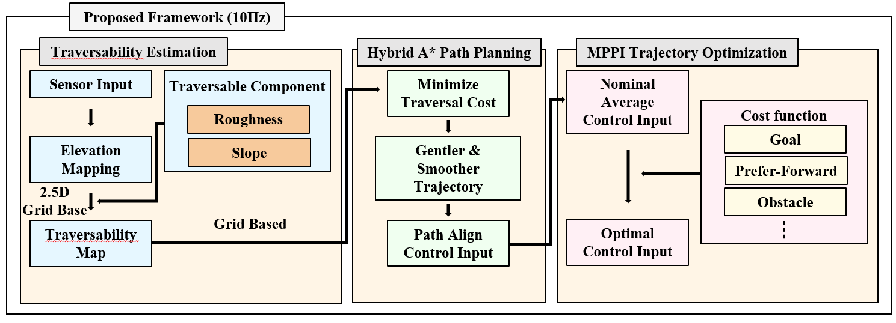
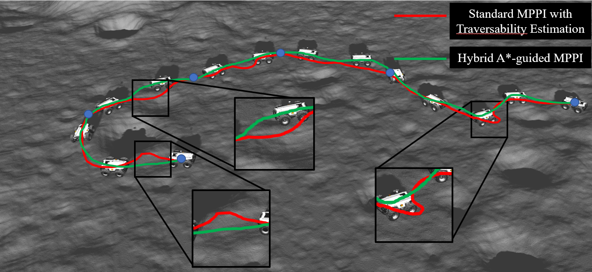

# Hybrid A*-guided MPPI
Hybrid A*-guided MPPI

This is a [ROS2] humble package developed for Hybrid A*-guided MPPI. The software is designed for (local) navigation tasks with robots on rough terrain, which are equipped with a pose estimation and distance sensor. The goal of this software is to provide navigation framework for rough terrain.

### Building

In order to install, clone the latest version from this repository into your workspace and compile the package using ROS2.

    cd your_workspace/src
    git clone https://github.com/er1c-cartman/Hybrid-Astar-guided-MPPI.git
    cd ../
    colcon build
    
    

# Gazebo simulation

First, set your model path to 
	
    export GAZEBO_MODEL_PATH=$GAZEBO_MODEL_PATH:$HOME/your_workspace/src/scout_v2/scout_gazebo/models
    
And run the simulation with
    
     ros2 launch scout_gazebo moon.launch.py
     

# Elevation mapping with traversability estimation

Elevation mapping code is originated from ETH Zurich 
- [Elevation mapping](https://github.com/ANYbotics/elevation_mapping)

    
And run the elevation mapping and traversability estimation with
    
     ros2 launch elevation_mapping elevation_mapping.launch.py 

To edit parameters of traversability estimation, you can change values in following file

$HOME/your_workspace/src/elevation_mapping/elevation_mapping/config/grid_map_filters.yaml

# Navigation

Navigation code is originated from NAV2 
- [Navigation 2](https://github.com/ros-navigation/navigation2)
    
And run the navigation with
    
     ros2 launch scout_navigation hybrid_mppi.launch.py

# Hybrid A*-guided MPPI

Our proposed framework is illustrated below.

The comparison of path generation with standard MPPI is presented below.

